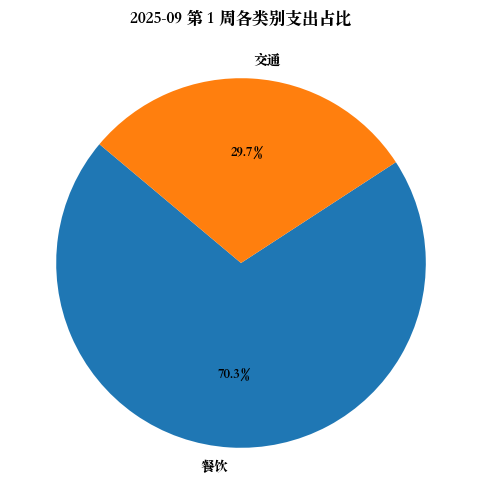
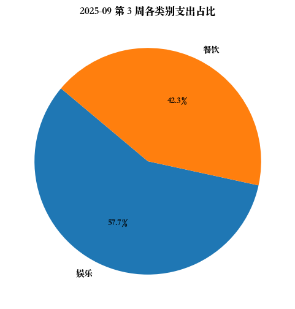
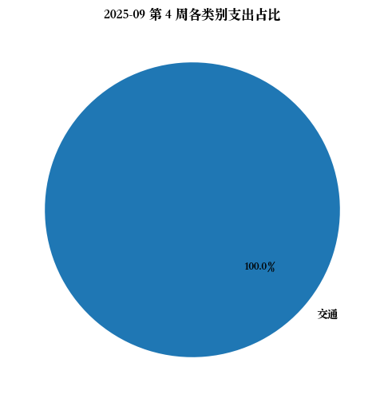
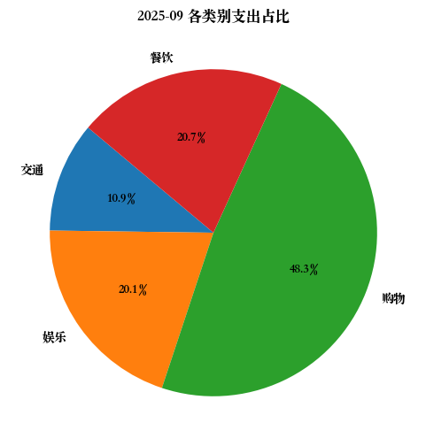
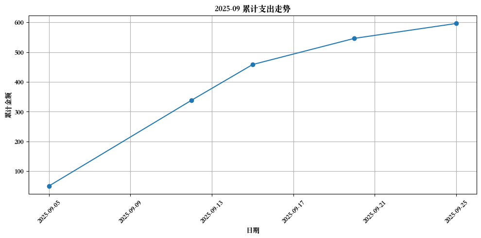
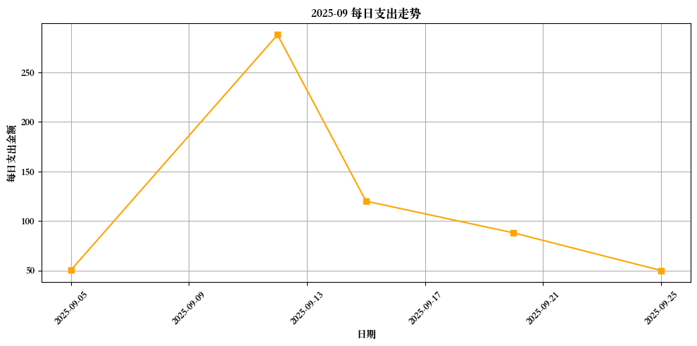

# 2025-09 月账单

### 第 1 周支出汇总 (2025-09-01 至 2025-09-07)

| 类别 | 金额 |
|------|------|
| 餐饮 | 35.50 |
| 交通 | 15.00 |
**本周总支出:** 50.50 元

### 第 2 周支出汇总 (2025-09-08 至 2025-09-14)

| 类别 | 金额 |
|------|------|
| 购物 | 288.00 |
**本周总支出:** 288.00 元

### 第 3 周支出汇总 (2025-09-15 至 2025-09-21)

| 类别 | 金额 |
|------|------|
| 娱乐 | 120.00 |
| 餐饮 | 88.00 |
**本周总支出:** 208.00 元

### 第 4 周支出汇总 (2025-09-22 至 2025-09-25)

| 类别 | 金额 |
|------|------|
| 交通 | 50.00 |
**本周总支出:** 50.00 元

# 月总账单

| 日期 | 类别 | 金额 | 类型 | 备注 |
|------|------|------|------|------|
| 2025-09-05 | 餐饮 | 35.50 | expense | 和同事的午餐 |
| 2025-09-05 | 交通 | 15.00 | expense | 地铁通勤 |
| 2025-09-10 | 薪水 | 8000.00 | income | 九月工资 |
| 2025-09-12 | 购物 | 288.00 | expense | 购买新键盘 |
| 2025-09-15 | 娱乐 | 120.00 | expense | 电影票和爆米花 |
| 2025-09-20 | 餐饮 | 88.00 | expense | 周末聚餐 |
| 2025-09-25 | 交通 | 50.00 | expense | 加油 |

## 各类支出汇总： 
| 类别 | 金额 |
|------|------|
|交通|65.00|
|娱乐|120.00|
|购物|288.00|
|餐饮|123.50|

## 本月小结
- 收入: 8000.00 元
- 支出: 596.50 元
- 净额: 7403.50 元

## 支出分类饼图

## 累计支出曲线

## 每日支出曲线

