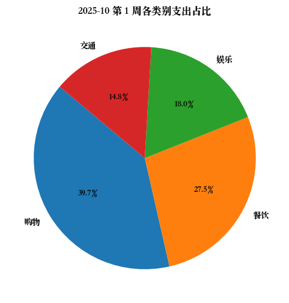
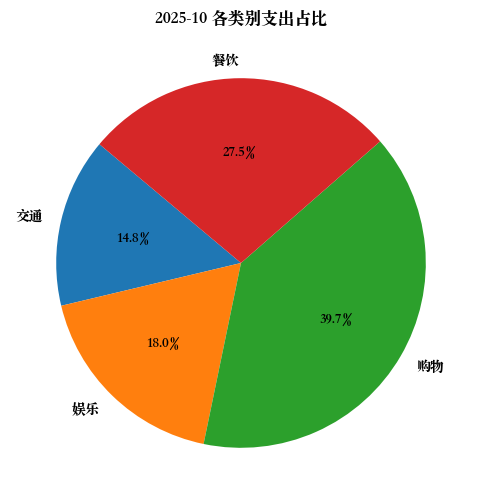
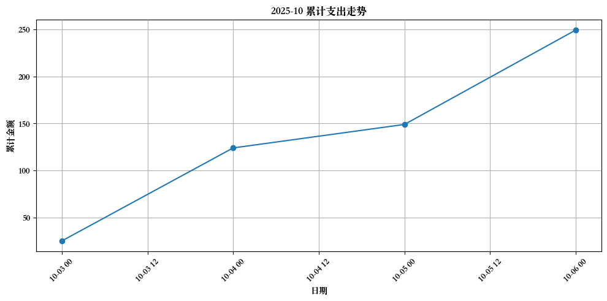
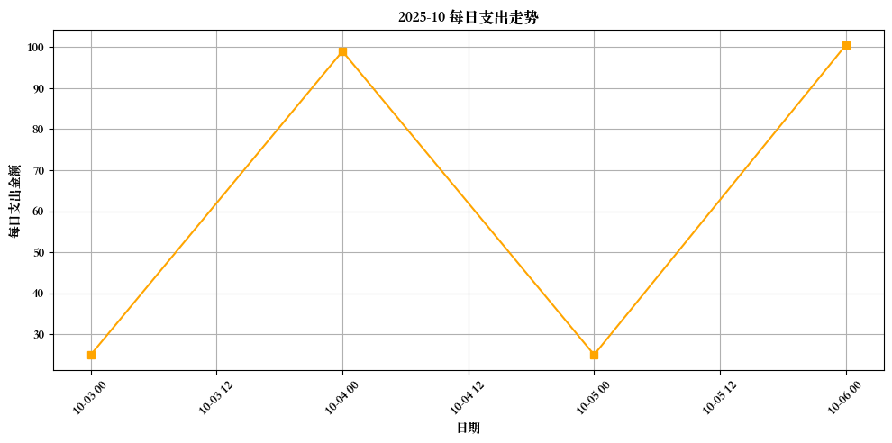

# 2025-10 月账单

### 第 1 周支出汇总 (2025-10-01 至 2025-10-06)

| 类别 | 金额 |
|------|------|
| 购物 | 99.00 |
| 餐饮 | 68.50 |
| 娱乐 | 45.00 |
| 交通 | 37.00 |
**本周总支出:** 249.50 元

# 月总账单

| 日期 | 类别 | 金额 | 类型 | 备注 |
|------|------|------|------|------|
| 2025-10-06 | 餐饮 | 25.00 | expense | 午餐 |
| 2025-10-03 | 餐饮 | 25.00 | expense | 午餐 |
| 2025-10-04 | 购物 | 99.00 | expense | 生活用品 |
| 2025-10-05 | 交通 | 25.00 | expense | 打车回家 |
| 2025-10-06 | 娱乐 | 45.00 | expense | 咖啡和甜点 |
| 2025-10-06 | 餐饮 | 18.50 | expense | 晚餐 |
| 2025-10-06 | 交通 | 12.00 | expense | 滴滴 |

## 各类支出汇总： 
| 类别 | 金额 |
|------|------|
|交通|37.00|
|娱乐|45.00|
|购物|99.00|
|餐饮|68.50|

## 本月小结
- 收入: 0.00 元
- 支出: 249.50 元
- 净额: -249.50 元

## 支出分类饼图

## 累计支出曲线

## 每日支出曲线

