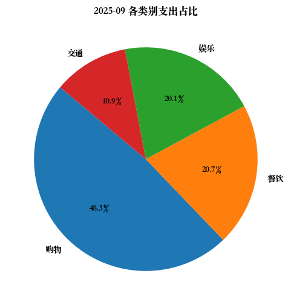
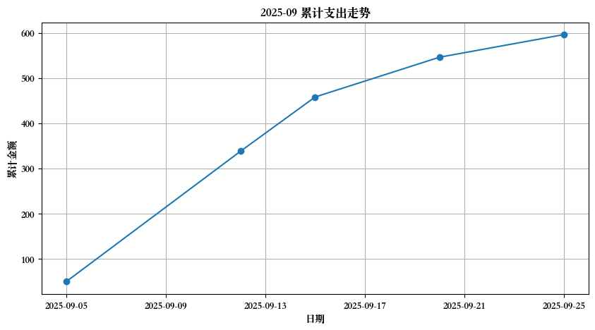
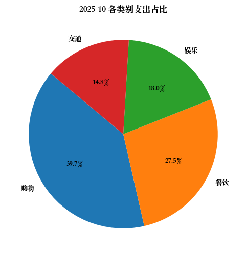
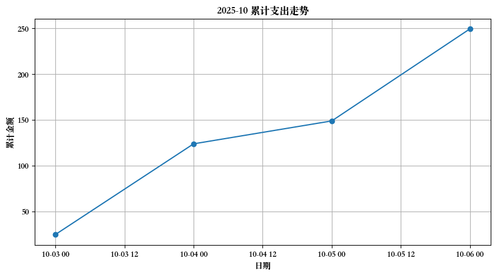
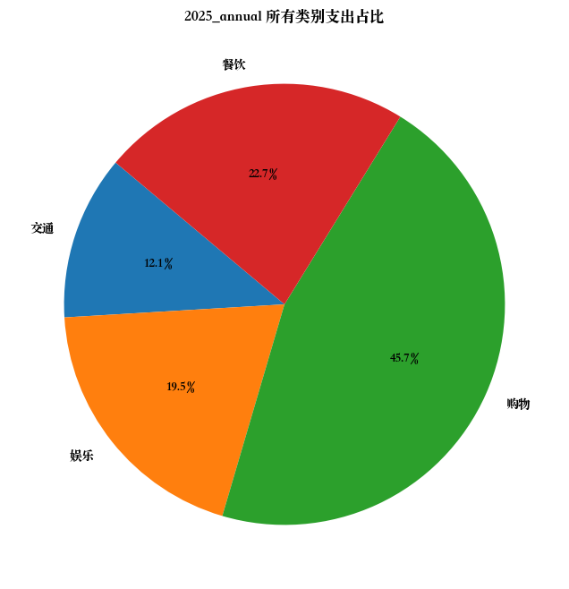
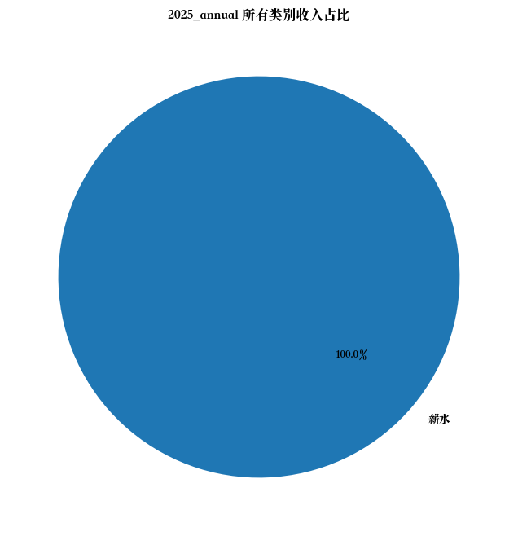
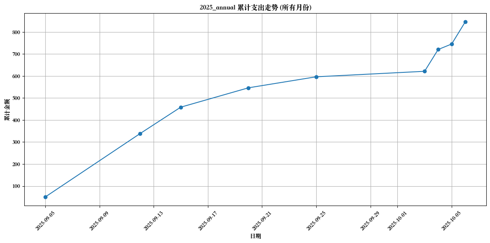
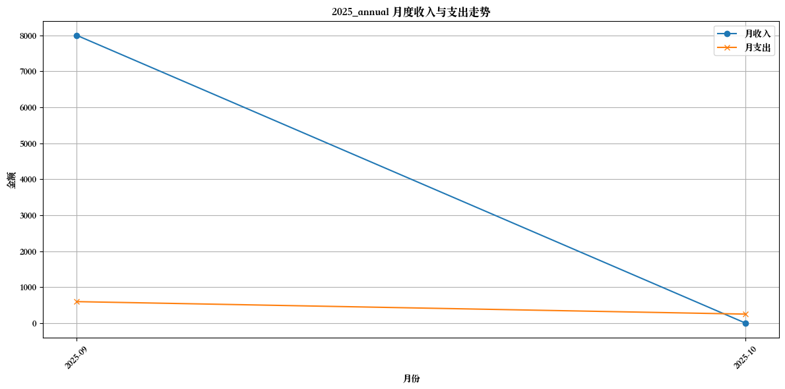

# 2025_annual 账单报告

## 2025-09 月账单

| 日期 | 类别 | 金额 | 类型 | 备注 |
|------|------|------|------|------|
| 2025-09-05 | 餐饮 | 35.5 | expense | 和同事的午餐 |
| 2025-09-05 | 交通 | 15.0 | expense | 地铁通勤 |
| 2025-09-10 | 薪水 | 8000.0 | income | 九月工资 |
| 2025-09-12 | 购物 | 288.0 | expense | 购买新键盘 |
| 2025-09-15 | 娱乐 | 120.0 | expense | 电影票和爆米花 |
| 2025-09-20 | 餐饮 | 88.0 | expense | 周末聚餐 |
| 2025-09-25 | 交通 | 50.0 | expense | 加油 |

### 2025-09 月小结
- 收入: 8000.00 元
- 支出: 596.50 元
- 净额: 7403.50 元

#### 2025-09 月各类别支出汇总

| 类别 | 金额 |
|------|------|
| 购物 | 288.00 |
| 餐饮 | 123.50 |
| 娱乐 | 120.00 |
| 交通 | 65.00 |

#### 2025-09 月各类别收入汇总

| 类别 | 金额 |
|------|------|
| 薪水 | 8000.00 |

#### 支出分类饼图

#### 累计支出曲线

---

## 2025-10 月账单

| 日期 | 类别 | 金额 | 类型 | 备注 |
|------|------|------|------|------|
| 2025-10-06 | 餐饮 | 25.0 | expense | 午餐 |
| 2025-10-03 | 餐饮 | 25.0 | expense | 午餐 |
| 2025-10-04 | 购物 | 99.0 | expense | 生活用品 |
| 2025-10-05 | 交通 | 25.0 | expense | 打车回家 |
| 2025-10-06 | 娱乐 | 45.0 | expense | 咖啡和甜点 |
| 2025-10-06 | 餐饮 | 18.5 | expense | 晚餐 |
| 2025-10-06 | 交通 | 12.0 | expense | 滴滴 |

### 2025-10 月小结
- 收入: 0.00 元
- 支出: 249.50 元
- 净额: -249.50 元

#### 2025-10 月各类别支出汇总

| 类别 | 金额 |
|------|------|
| 购物 | 99.00 |
| 餐饮 | 68.50 |
| 娱乐 | 45.00 |
| 交通 | 37.00 |

#### 支出分类饼图

#### 累计支出曲线

---

## 所有月份汇总

### 所有月份收入类别总计

| 类别 | 金额 |
|------|------|
| 薪水 | 8000.00 |

### 所有月份支出类别总计

| 类别 | 金额 |
|------|------|
| 购物 | 387.00 |
| 餐饮 | 192.00 |
| 娱乐 | 165.00 |
| 交通 | 102.00 |

### 所有月份支出分类饼图

### 所有月份收入分类饼图

### 所有月份累计支出曲线

### 月度收入与支出折线图

