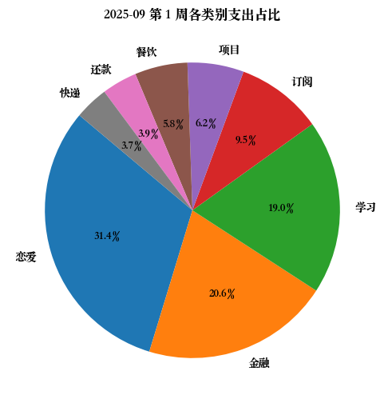
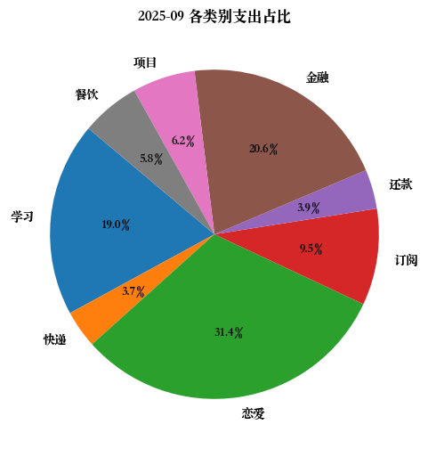
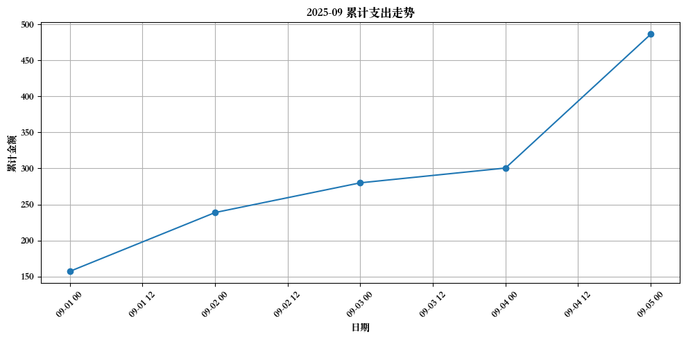
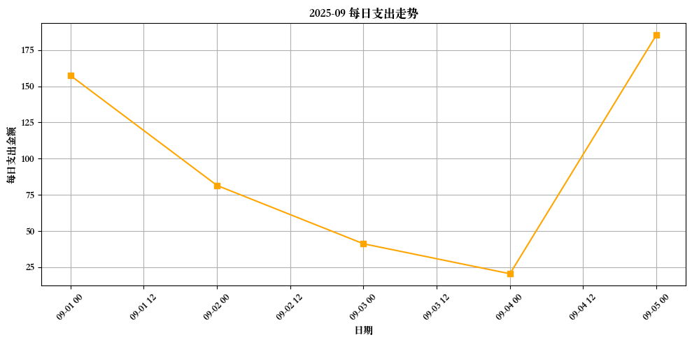

# 2025-09 月账单

### 第 1 周支出汇总 (2025-09-01 至 2025-09-05)

| 类别 | 金额 |
|------|------|
| 恋爱 | 152.60 |
| 金融 | 100.00 |
| 学习 | 92.60 |
| 订阅 | 46.00 |
| 项目 | 30.00 |
| 餐饮 | 28.10 |
| 还款 | 18.80 |
| 快递 | 18.00 |
**本周总支出:** 486.10 元

| 日期 | 类别 | 金额 | 类型 | 备注 |
|------|------|------|------|------|
| 2025-09-02 | 恋爱 | 15.20 | expense | 外卖 |
| 2025-09-02 | 恋爱 | 25.60 | expense | 外卖 |
| 2025-09-01 | 学习 | 92.60 | expense | 书籍 |
| 2025-09-03 | 餐饮 | 11.20 | expense | 外卖 |
| 2025-09-02 | 恋爱 | 15.00 | expense | 礼物 |
| 2025-09-01 | 还款 | 18.80 | expense | 美团月付 |
| 2025-09-02 | 餐饮 | 5.70 | expense | 外卖 |
| 2025-09-04 | 恋爱 | 50.00 | income | 疯狂星期四 |
| 2025-09-04 | 恋爱 | 20.50 | expense | 外卖 |
| 2025-09-05 | 快递 | 18.00 | expense | 还手机 |
| 2025-09-05 | 金融 | 100.00 | expense | 定投 |
| 2025-09-05 | 餐饮 | 11.20 | expense | 外卖 |
| 2025-09-01 | 盈余 | 1000.00 | income | 暑假剩余 |
| 2025-09-01 | 订阅 | 21.00 | expense | 百度网盘续费 |
| 2025-09-03 | 项目 | 30.00 | expense | 服务器包月 |
| 2025-09-01 | 订阅 | 25.00 | expense | iCloud |
| 2025-09-02 | 恋爱 | 20.00 | expense | 转账 |
| 2025-09-05 | 恋爱 | 24.50 | expense | 外卖 |
| 2025-09-05 | 恋爱 | 31.80 | expense | 外卖 |

## 本月小结
- 收入: 1050.00 元
- 支出: 486.10 元
- 净额: 563.90 元

## 支出分类饼图

## 累计支出曲线

## 每日支出曲线

